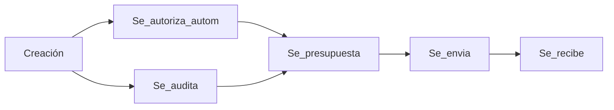
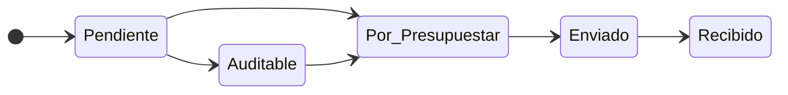

# Alcance del módulo

El módulo encargado tiene como objetivo en primer lugar, la gestión de los pedidos de medicamentos a las farmacias, cubriendo el trayecto desde que se recibe la orden médica que especifíca
lo que necesita el afiliado, hasta que se le entrega lo que pidió. El proceso implica la generación, auditoría, envío y confirmación de los pedidos.
También debe ser capaz de llevar un stock de lo que está disponible en la farmacia de la obra social.

## Usuarios del sistema

El sistema contará con los siguientes usuarios:
- Operador de carga
- Médico auditor
- Contador
- Farmacéutico

#### Diagrama de casos de uso

### Operador de carga
Encargado de cargar en el sistema lo que recibe está en la orden médica recibida del afiliado. Deberá indicar toda la información pertinente para la auditoría del pedido.
En el caso de los medicamentos que tengan recupero, deberá recibir un aviso por parte del sistema como recordatorio de la información extra que debe pedir al afiliado.
También tendrá la posibilidad de actualizar el listado de medicamentos.

### Médico auditor
Encargado de auditar los pedidos de medicamentos, estableciendo el porcentaje de cobertura que le dará la obra social, o pudiendo también rechazarlos.
Deberá contar con toda la información que pueda llegar a necesitar para evaluar el pedido de forma accesible.

### Contador
Encargado de hacer el pedido de los medicamentos. También puede auditar los medicamentos, modificando los porcentajes de cobertura que se les aplicarán.
Debe poder exportar a planilla de cálculo y a PDF los pedidos, para enviarlos a las droguerías.
Es el encargado de especificar la información de dónde se realizaron los pedidos de los medicamentos, actualizando esta información en el pedido, para que el farmacéutico
sepa de dónde viene, y cuando.

### Farmacéutico
Encargado de recepcionar los medicamentos. Debe indicar cuando se recepcionan los mismos, dando por finalizado el ciclo de vida del pedido. 
Además, debe poder mantener actualizado el stock

## Entidades

### Afiliado
Persona afiliada a la obra social. La entidad persona del modulo farmacia debe estar vinculadad directa o indirectamente con la entidad persona del modulo de afiliacion. 
En principio, solamente es necesario contar con los siguientes campos:

- ID
- Nombre
- Apellido
- DNI
- Observaciones

Se debe evaluar si se puede reutilizar la tabla del módulo de afiliación, o crear una tabla específica para este módulo. La complejidad de crear otra tabla, para por el mantenimiento que se le deberá realizar desde el módulo de afiliación, ya que todos los cambios que se realicen en los afiliados deberán verse reflejados en éste módulo también.

### Pedido farmacia
Entidad compuesta, contiene el listado de todos los medicamentos y las personas que los pidieron. Tendrá asociado un detalle. Cuenta con los siguientes atributos:

- ID
- Estado
- Fecha_creacion
- Fecha_recepcion

#### Diagrama de flujo de un pedido

#### Diagrama de estados de un pedido

### Detalle pedido
Entidad débil, contenida con por el pedido de farmacia. Contiene la información de 1 pedido de medicamento de 1 afliado. Cuenta con:

- Id
- Id_afiliado
- Detalle
- Id_medicamento
- Cantidad

### Item farmacia
Entidad central del módulo. Cuenta con:

- ID
- Principio_activo
- Presentación
- Marca
- Recupero (bool)
- Cobertura_diabetes (bool)
- Cobertura_discapacidad (bool)
- Cobertura_anticonceptiva (bool)
- Cobertura_70 (bool)
- Cobertura_oncologica (bool)
- Tope_anual
- Tope_mensual

## Base de Datos
