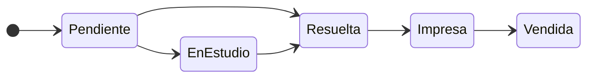
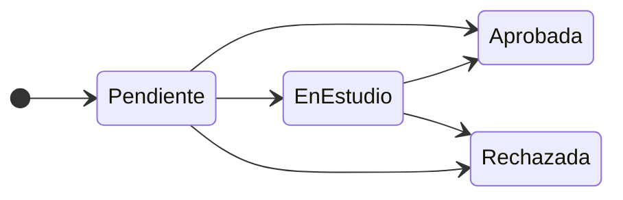

# Alcance del módulo

El módulo que fue encargado tiene como principal objetivo permitir administrar todo lo referido a las órdenes de prácticas médicas que piden los beneficiarios de una obra social. Esto implica: administrar órdenes médicas, gestionar un padrón de prestadores asociados, y permitir la actualización de los PMO (prácticas médicas obligatorias) vigentes en conjunto de los valores de coseguro asociados a las mismos.

En este documento, se tratará de forma indistinta a los términos "práctica médica" y "consulta médica". Ambos están nomenclados dentro del listado de PMO, por lo que son
tratados de la misma manera por el sistema.

## Usuarios del sistema

El sistema contará con dos tipos de usuarios: operadores y médicos auditores.

#### Diagrama de casos de uso

### Operadores

Los operadores estarán a cargo de la creación, modificación, e impresión de las órdenes médicas. Atienden a los beneficiarios, asocian distintan prácticas a una orden, y se encargan de imprimir las mismas para venderlas cuando el beneficiario las necesite. Los operadores también estarán a cargo de mantener actualizado el padrón de prestadores asociados a la obra social, el cual será usado al momento de crear una nueva orden médica.

### Médico auditor

Una orden contiene una o más prácticas (o pedidos de consultas). Si una orden contiene un pedido de una práctica de complejidad media o alta, la misma es puesta en espera hasta la evaluación de un médico auditor, el cual decide que hará con la misma. El médico auditor se encarga de evaluar las órdenes, decidiendo si las prácticas son aprobadas, rechazadas, o puestas en espera. Cuando una práctica es puesta en espera, el médico necesita obtener más información del beneficiario sobre su situación, antes de tomar una decisión.

El médico auditor tendrá también la potestad de editar los PMO, pudiendo agregar, modificar, o dar de baja los que considere necesarios.

## Entidades

### Ordenes médicas

Las órdenes médicas serán creadas, evaluadas, e impresas por los usuarios del sistema. Estarán asociadas a una entidad llamada "beneficiario". El beneficiario puede ser el titular del plan de la obra social, o un familiar del mismo (para éste módulo, son lo mismo), y estarán cargado en el sistema. El ABM de los titulares y familiares es administrado desde otro módulo distinto a éste.

#### Diagrama de flujo de una orden

Una orden médica debe contar con la siguiente información:

- DNI del beneficiario
- Fecha de solicitud: fecha de la solicitud del médico
- Fecha de carga: fecha en la que se crea la orden
- Fecha de vencimiento: fecha tope hasta donde tiene validez la orden 
- Solicitante: prestador asociado a la orden social
- Diagnóstico
- Derivación
- Observaciones
- Detalle de las prácticas o consultas que se piden. Se detallan como una lista de items, donde cada práctica tiene que tener un código (correspondiente al PMO), una descripción, una cantidad, y un importe asociado al coseguro que se le cobra.
- Bonificación: descuento opcional al importe a pagar

Aparte de estos datos, la orden cuenta con los siguientes parámetros para uso interno del sistema:

- Urgencia: una orden puede ser creada con una bandera de urgencia, la cual es usada para informar al auditor cuales órdenes tienen prioridad y deben ser evaluadas
 lo antes posible.
- Estado: corresponde al estado visible en la visualización de las ordenes. Una vez creada una orden, si la misma no cuenta con prácticas de mediana o alta complejidad asociadas, es autorizada automaticamente entrando en estado "resuelta". En caso contrario, entra en estado de "pendiente de visualización", debiendo ser evaluada por un médico auditor. Una vez que el médico auditor la evalúa, si alguna práctica tomó el estado de "en estudio", la orden tomará el estado "en estudio", hasta que el médico tomé una decisión respecto a la misma. Una vez que todas las prácticas hayan sido evaluadas, la orden pasará al estado de "Resuelta". Una vez impresa la orden, pasará al estado "Impresa", y opcionalmente, se podrán marcar como "Vendidas", con el fin de evitar sobrepoblar la interfaz de vista de órdenes para los operadores.

#### Diagrama de estados de una orden

Basta con que haya 1 práctica de la orden cuyo estado actual sea "en estudio" para que el estado de la orden sea "en estudio". Solamente cuando todas las prácticas fueron evaluadas,
y tienen como estado "Aprobada" o "Rechazada", la orden estará en estado "resuelto". Una misma orden puede contener prácticas que se encuentren aprobadas y rechazadas a la vez, y la misma podrá
ser impresa solamente cuando se encuentre en estado "resuelta".

### Prácticas médicas

Las prácticas médicas están nomencladas en lo que se conoce como PMO, o "Prácticas médicas obligatorias". Esta nomenclatura le asigna un código distintivo a cada
práctica, el cual sirve para identificarlas, y organizarlas dentro de distintas categorías. Por ejemplo, todos los códigos que comienzan con "420101" corresponden a consultas médicas.

Una orden médica contiene una o más prácticas médicas. Cada práctica médica se evalúa de forma individual, por lo que cada una se encontrará en un estado propio, independiente del resto de las demás prácticas, y de la misma orden. Por este motivo, cada práctica y consulta médica será tratada como un ítem de la orden.

#### Diagrama de estados de una práctica

Las prácticas médicas se clasifican según su complejidad. Las que tienen complejidad alta, serán autorizadas automáticamente por el sistema. En estos casos, se establecen topes mensuales o anuales según el caso.
Las prácticas de complejidad media o alta por lo general son auditables, debiendo ser evaluadas por un médico auditor. El médico puede rechazar, aprobar, o pedir más información respecto a la práctica, dejándola en un estado de "En estudio". 

### Prestadores

Los prestadores son los profesionales asociados a la obra social. Inicialmente, para poder hacer el vínculo con la orden médica, es necesario el número de matrícula, y el nombre de cada uno.

### PMO

Los planes médicos obligatorios son fijados desde nación como prácticas que la obra social está obligada a cubrir. Constan de un código identificatorio y una descripción.
Para el uso en este módulo, se deberá especificar cuales son autorizados automáicamente, y cuál es el límite mensual y anual en estos casos.
